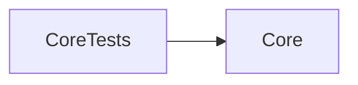

```mermaid
flowchart LR
  CoreTests --> Core
```

| File | What | Status |
|---|---|---|
| [CoreTests.swift](CoreTests.swift) | Core unit test | ✅ Linux verified |

Start with the linked file; [package map](../README.md).
